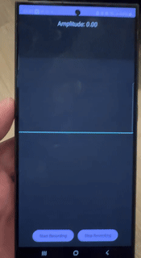

# whoami

I’m a deep learning and computer vision enthusiast who loves building things that *just might* make life easier—or at least more interesting. If you spot me squinting at a screen, I’m probably wrangling neural networks or figuring out how to make an AI agent tap around an Android screen all by itself. Here’s a quick peek at my journey and some of the projects I’ve built along the way.

---

## In a Nutshell

- **Senior Deep Learning Engineer** with 5+ years of experience, focusing on everything from classification and segmentation to OCR and multi-modal transformer reasoning models.  
- **Upwork Top Rated Plus** contractor, recognized in the top 1% of AI developers, with 100% Job Success.  
- **Mentor & Teacher**: I’ve led corporate programs, taught undergraduates the fundamentals of computer vision, and discovered I really enjoy sharing knowledge.

---

## Toolbelt & Tech Playground

- **Frameworks/Libraries**: PyTorch, TensorFlow, Keras, FastAI, OpenAI APIs, CLIP, Vision-Language foundation models.  
- **Languages**: Primarily Python, with supporting roles from Dart (Flutter), Kotlin/Java, Swift, and C++.  
- **DevOps & Infra**: GCP, AWS, Docker, Kubernetes, Cloud Build, Cloud Run, and a dash of ML Ops for good measure.  
- **Mobile & Embedded**: TensorRT, TFLite, CoreML, ONNX, etc.

---

## Some Projects & Creations

### Quick Links to Projects
1. [Android Remote Control with VLM AI Agents](https://zack-dev-cm.github.io/github-repo-sum.github.io/#1-android-remote-control-with-vlm-ai-agents)  
2. [Control VLM-LLM Agent Silently With Your Breath](https://zack-dev-cm.github.io/github-repo-sum.github.io/#2-control-vlm-llm-agent-silently-with-your-breath)  
3. [Create, Chat & AR Experience with AI-Character (Text2Room)](https://zack-dev-cm.github.io/github-repo-sum.github.io/#3-create-chat--ar-experience-with-ai-character-text2room)  
4. [Label and Inpaint Anything in a Room Interior](https://zack-dev-cm.github.io/github-repo-sum.github.io/#4-label-and-inpaint-anything-in-a-room-interior)  
5. [Smart Drive for Smart City: Predict Optimal Speed](https://zack-dev-cm.github.io/github-repo-sum.github.io/#5-smart-drive-for-smart-city-predict-optimal-speed-to-the-nearest-traffic-light-or-jam)  
6. [Estimate Golf Ball Trajectory](https://zack-dev-cm.github.io/github-repo-sum.github.io/#6-estimate-golf-ball-trajectory)  
7. [Pixel-Wise Segmentation of Spare Parts for 3D Printing](https://zack-dev-cm.github.io/github-repo-sum.github.io/#7-pixel-wise-segmentation-of-spare-parts-for-3d-printing)  
8. [Food Recognition App](https://zack-dev-cm.github.io/github-repo-sum.github.io/#8-food-recognition-app)  
9. [Python Library: AutoToloka](https://zack-dev-cm.github.io/github-repo-sum.github.io/#9-python-library-autotoloka)  
10. [Python Library: shiftlab-ocr](https://zack-dev-cm.github.io/github-repo-sum.github.io/#10-python-library-shiftlab-ocr)  
11. [Face Antispoofing & Multi-Modal Vision-Language Models](https://zack-dev-cm.github.io/github-repo-sum.github.io/#11-face-antispoofing--multi-modal-vision-language-models)  
12. [GitHub Repo Summarizer (Chrome Extension)](https://zack-dev-cm.github.io/github-repo-sum.github.io/#12-github-repo-summarizer-chrome-extension)  
13. [ChatGPT|Deepseek|AIStudido Navigator (Chrome Extension)](https://zack-dev-cm.github.io/github-repo-sum.github.io/#13-chatgpt-scrollbar-chrome-extension)
14. [**Task Zavod – Micro-Task Marketplace**](#14-task-zavod--micro-task-marketplace)  
15. [**Trending Prompts Feed**](#15-trending-prompts-feed)  

---

### 1. Android Remote Control with VLM AI Agents
**“Hands-free” Android automation? Yes, please.**  
A custom Android app that captures screenshots and sends them to vision-language AI agents which determine the next UI action—tap, swipe, or type.  
- **Real-Time**: Receives instructions from powerful server-based models.  
- **Use Cases**: Automated testing, daily phone tasks, or exploring novel ways to control a device.

**Demo Link**: [View MP4 in Google Drive](https://drive.google.com/file/d/13UQTdBVsZwPclMOca6Nmaywk4BiRydbi/view?usp=sharing)  

---

### 2. Control VLM-LLM Agent Silently With Your Breath
Start or stop the neural network with your breath. “Start listening” might be 2–3 short exhalations, while a smooth exhalation says “stop.” It’s all about recognizing **breathing** patterns, not your voice. After calibration (reading text aloud vs. silently), it learns to detect words from the sounds of breathing or even sniffles.

**Demo Link**: [View GIF in Google Drive](https://drive.google.com/file/d/1H43aT5n8NWlOuTIWsJinssKRh1n3tiOM/view?usp=sharing)  

---

### 3. Create, Chat & AR Experience with AI-Character (Text2Room)
**Image & Video Generation • Inpainting • TryOn • Reasoning & More**  
Spin up an AI “character,” style them, dress them up, chat via Telegram, or even place them in your living room! Ideal for marketing campaigns, creative collaborations, or simply exploring next-gen generative AI.

- [**Live Demo (Colab-based)**](https://adfeed-1095464065298.us-central1.run.app/)  
- **Video Link**: [View MP4 with Sound in Google Drive](https://drive.google.com/file/d/1kvg4gjCNFPmrI3URPsM3eIyQ_vqSk1Ow/view?usp=sharing)

---

### 4. Label and Inpaint Anything in a Room Interior
Label objects in a photo and then seamlessly inpaint them—complete with realistic shadows and lighting for interior makeovers.

**Inpainting Demos (Google Drive):**  
- [Segmentation](https://drive.google.com/file/d/1XqQgbmBgTlRRdR-K3X4PHlSzrmiMUJgY/view?usp=sharing)  
- [Inpaint #1](https://drive.google.com/file/d/1dCkeI7Mi87cg2kOgY5UCLG-DiHkt358L/view?usp=sharing)  
- [Inpaint #2](https://drive.google.com/file/d/1xRmS8AXMJcmk-S0mth8yUQpltyfPkOSI/view?usp=sharing)  
- [Inpaint #3](https://drive.google.com/file/d/18kD2cm0uYmzudvOqVFmtJ8ZCkEbqqIHc/view?usp=sharing)

| Original                                     | Another Example                                |
|----------------------------------------------|------------------------------------------------|
|  |  |

---

### 5. Smart Drive for Smart City: Predict Optimal Speed to the Nearest Traffic Light or Jam
Find the optimal speed to the nearest traffic light. For example, while driving you may wonder whether to speed up a bit or slow down—the program predicts the ideal speed for your journey, calculating optimal speeds for each traffic light or even nearby traffic jams.

---

### 6. Estimate Golf Ball Trajectory
Analyze your golf swing or develop sports analytics solutions—this AI estimates the golf ball trajectory and more.

---

### 7. Pixel-Wise Segmentation of Spare Parts for 3D Printing
Precisely identify which parts need 3D printing or rework.

- [Segmentation #1](https://drive.google.com/file/d/1bAyEPYLbiETD0vKStnpB1VvzK1wKdKRv/view?usp=sharing)  
- [Segmentation #2](https://drive.google.com/file/d/1xVEonSJ7jvnYSnQ6ztvFZy-Llf_dxSrP/view?usp=sharing)

Local files:

| Example 1                                    | Example 2                                    |
|----------------------------------------------|----------------------------------------------|
|  |  |

---

### 8. Food Recognition App
**When you want your phone to know what’s for dinner**  
An AI app that identifies food items (packaged or fresh) and performs OCR on labels.  
- **Nutritional Info**: Extracts brand names, nutrient data, and portion sizes.  
- **Real-Time Performance**: Over 90% accuracy, optimized for CPU/GPU inference.  
- **Cross-Platform**: Available on both iOS & Android.

**Demo Link**: [View GIF in Google Drive](https://drive.google.com/file/d/1RRRVYH0DLILZX84v5x0boj68VfMqnWWf/view?usp=sharing)

---

### 9. Python Library: AutoToloka
**Speedy Dataset Prep & Crowdsourcing**  
A Python library to help set up and validate datasets using interactive segmentation and multi-modal networks under the hood.  
- **Reduces Labeling Costs**: Automates a significant portion of manual labeling.  
- **Scalable**: Easily integrates with pipeline tools, containerized deployments, and major cloud providers.

[**AutoToloka on PyPI**](https://pypi.org/project/autotoloka/)

---

### 10. Python Library: shiftlab-ocr
A library for handwriting text segmentation and character recognition.

[**shiftlab-ocr on PyPI**](https://pypi.org/project/shiftlab-ocr/)

---

### 11. Face Antispoofing & Multi-Modal Vision-Language Models
Experimenting with CLIP and other multi-modal setups, this project tackles face authentication spoofing by bridging text-image embeddings with specialized neural networks.

[**YouTube Presentation**](https://www.youtube.com/watch?v=jJnyj0OH0lk&t=285s&ab_channel=TolokaAI)

---

### 12. GitHub Repo Summarizer (Chrome Extension)
**Speed-read Your Repositories**  
Fetches and summarizes the code structure of GitHub repositories using your locally stored GitHub personal access token—**no servers involved**.  
- **Privacy First**: Your token remains on your device.  
- **Auto Summaries**: Quickly see how a repository is organized, from directories to key code files.

[**GitHub Repo Summarizer**](https://chromewebstore.google.com/detail/github-repo-summarizer/ccikgbjalcbokaalidnfcjhhbhjoljfm)

---

### 13. ChatGPT|Deepseek|AIStudio Navigator (Chrome Extension)
**Tired of endlessly scrolling through ChatGPT’s conversation feed?**  
Chat Navigator adds an optional, keyboard-accessible scrollbar with “message dots” to ChatGPT, DeepSeek and Google AI Studio chat pages. The dots let users jump instantly to any earlier message. The extension also offers a lightweight prompt-autocomplete panel and a compact settings popup. Prompts could be shared and ranked, improving suggestions.

**Demo Link**: [View GIF in Google Drive](https://drive.google.com/file/d/1fhf6l85wv-uYGc_jqDdoEXHvDMYBLyH4/view?usp=sharing)  

[**ChatGPT|Deepseek|AIStudio Navigator**](https://chromewebstore.google.com/detail/chatgpt-scrollbar/jnoonpeekddinkiecaonhocaflcgbhap?pli=1)

### 14. Task Zavod – Micro-Task Marketplace
Build, validate, and **pay out micro-tasks automatically**.
https://food-n-bot-dev-1095464065298.us-central1.run.app/task_zavod
| &nbsp; | &nbsp; |
|--------|--------|
| **Stack** | Tornado (Web + SSE) · SQLite · OpenAI  · VLM · Telegram Bot API |
| **Problem** | Crowdsourcing routine QA jobs is fragile: you need clear instructions, proof, and fast payout. |
| **Solution** | **Task Zavod** lets a business user drop free-form text → VLM converts it to a structured task; workers pick it up in a web feed *or* via Telegram bot, upload results, and an VLM auto-approves/denies. |
| **Cool bits** | *Live* status polling, autopayment with VLM
**Demo GIF**  
 <!-- replace with real GIF if you have one -->

---

### 15. Trending Prompts Feed
https://food-n-bot-dev-1095464065298.us-central1.run.app
A **Reddit-style board for viral prompts**—built on Tornado backend.

* **Upvote / Downvote ranking** with real-time *trending* score.  
* **Integration with autocomplete for ChatGPT|Deepseek|AIStudio Navigator** + client-side sort (Trending 🔥 / Latest ✨).  

> ✨ **Why it matters:** it was the tiny experiment that convinced me “prompt engineering” can be *crowd-sourced*. The feature has since been ported into my ChatGPT|Deepseek|AIStudio Navigator extension.

---

## More Highlights

- **Top 1%** on Upwork for AI/ML tasks.  
- **Mentored** teams at corporate events, universities, and School of AI chapters.  
- **Hackathon Finalist**: Recognized in competitions like Digital Transformation and PicsArt AI.

[**See more on LinkedIn**](https://www.linkedin.com/in/zakhar-pashkin-a524a6163/)

---

## More Projects
**GitHub**: [github.com/zack-dev-cm](https://github.com/zack-dev-cm)  
**GitHub**: [github.com/ZackPashkin](https://github.com/ZackPashkin)

If you’re looking for:

- **Custom AI Solutions** (computer vision, NLP, or multi-modal)  
- **Mobile & Embedded Model Optimization**  
- **ML Ops** for GCP/AWS or on-prem solutions  

Then let’s talk!

**Email**: [kaisenaiko@gmail.com](mailto:kaisenaiko@gmail.com)  

Thanks for stopping by. Let’s see where AI can take us next!
