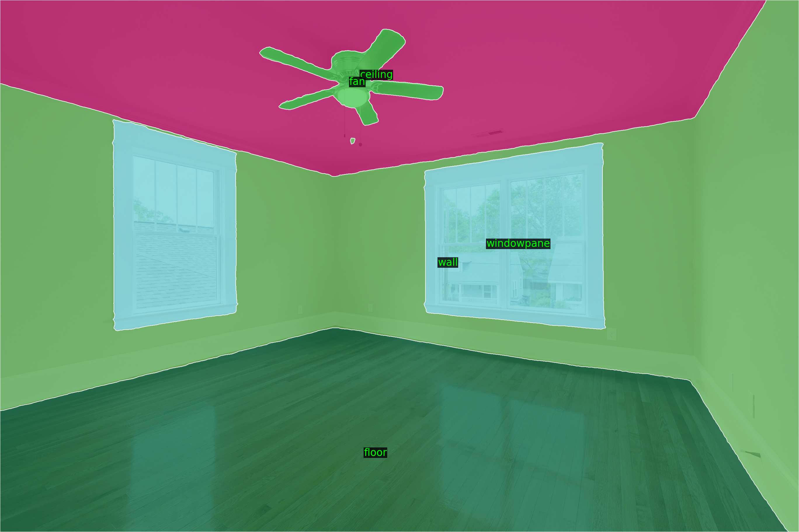
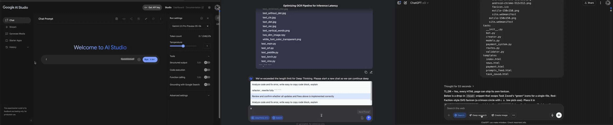
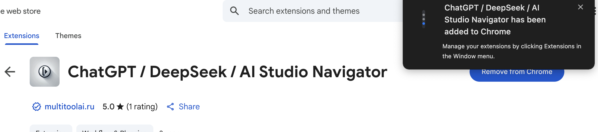
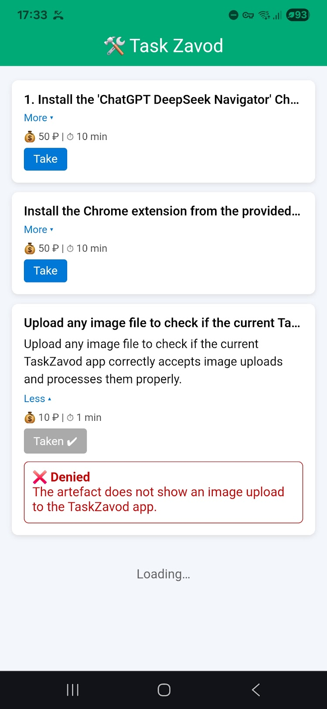

# About Me

I'm a Deep Learning and Computer Vision enthusiast passionate about building impactful solutions that simplify tasks and spark curiosity. You'll often find me engrossed in training neural networks or architecting AI agents capable of autonomously navigating Android UIs. Below is an overview of my journey, expertise, and some of the innovative projects I've brought to life.

---

## Key Highlights

-   **Senior Deep Learning Engineer** with 5+ years of dedicated experience, specializing in areas from image classification and segmentation to Optical Character Recognition (OCR) and advanced multi-modal Transformer reasoning models.
-   **Upwork Top Rated Plus Contractor**, consistently ranked in the **top 1% of AI developers** with a **100% Job Success Score**, demonstrating reliability and high-quality deliverables.
-   **Proven Mentor & Educator**, having led corporate training programs, instructed undergraduates in Computer Vision fundamentals, and discovered a passion for knowledge sharing.
-   **Hackathon Finalist** in prestigious competitions like Digital Transformation and PicsArt AI, showcasing innovative problem-solving under pressure.

---

## My Tech Stack

-   **Frameworks & Libraries**: PyTorch, TensorFlow, Keras, FastAI, OpenAI APIs, CLIP, Vision-Language Foundation Models (VLMs), LLMs.
-   **Programming Languages**: Primarily Python; proficient in Dart (Flutter), Kotlin/Java, Swift, and C++ for supporting roles and mobile development.
-   **DevOps & Infrastructure**: Google Cloud Platform (GCP), Amazon Web Services (AWS), Docker, Kubernetes, Cloud Build, Cloud Run, and robust ML Ops practices.
-   **Mobile & Embedded Optimization**: TensorRT, TensorFlow Lite (TFLite), CoreML, ONNX for efficient on-device deployment.

---

## Selected Projects & Innovations

This section provides a glimpse into projects I've developed. For quick navigation:

1.  [Android Remote Control with VLM AI Agents](#1-android-remote-control-with-vlm-ai-agents)
2.  [Control VLM-LLM Agent Silently With Your Breath](#2-control-vlm-llm-agent-silently-with-your-breath)
3.  [Create, Chat & AR Experience with AI-Character (Text2Room)](#3-create-chat--ar-experience-with-ai-character-text2room)
4.  [Label and Inpaint Anything in a Room Interior](#4-label-and-inpaint-anything-in-a-room-interior)
5.  [Smart Drive for Smart City: Predict Optimal Speed](#5-smart-drive-for-smart-city-predict-optimal-speed)
6.  [Estimate Golf Ball Trajectory](#6-estimate-golf-ball-trajectory)
7.  [Pixel-Wise Segmentation of Spare Parts for 3D Printing](#7-pixel-wise-segmentation-of-spare-parts-for-3d-printing)
8.  [Food Recognition App](#8-food-recognition-app)
9.  [Python Library: AutoToloka](#9-python-library-autotoloka)
10. [Python Library: shiftlab-ocr](#10-python-library-shiftlab-ocr)
11. [Face Antispoofing & Multi-Modal Vision-Language Models](#11-face-antispoofing--multi-modal-vision-language-models)
12. [GitHub Repo Summarizer (Chrome Extension)](#12-github-repo-summarizer-chrome-extension)
13. [ChatGPT|Deepseek|AIStudio Navigator (Chrome Extension)](#13-chatgptdeepseekaistudio-navigator-chrome-extension)
14. [Task Zavod – Micro-Task Marketplace](#14-task-zavod--micro-task-marketplace)
15. [Trending Prompts Feed](#15-trending-prompts-feed)

---

### 1. Android Remote Control with VLM AI Agents
**Description**: An innovative Android application enabling "hands-free" device automation. It captures screenshots and transmits them to server-based Vision-Language AI agents, which then determine and execute the next UI action (tap, swipe, type).
**Key Features**: Real-time instruction processing, automated testing, task automation, novel device interaction.
**Tech Stack**: Android, Vision-Language Models (VLMs), Server-side AI.
**Demo**: [View MP4 on Google Drive](https://drive.google.com/file/d/13UQTdBVsZwPclMOca6Nmaywk4BiRydbi/view?usp=sharing)

---

### 2. Control VLM-LLM Agent Silently With Your Breath
**Description**: A system that allows users to start or stop a neural network agent using distinct breathing patterns (e.g., short exhalations to start, smooth exhalation to stop), rather than voice commands. After a calibration phase, it accurately detects commands from breathing sounds or even sniffles.
**Key Features**: Non-verbal AI control, pattern recognition of breathing acoustics.
**Tech Stack**: Audio processing, Neural Networks.
**Demo**: [View GIF on Google Drive](https://drive.google.com/file/d/1H43aT5n8NWlOuTIWsJinssKRh1n3tiOM/view?usp=sharing)

---

### 3. Create, Chat & AR Experience with AI-Character (Text2Room)
**Description**: A versatile platform for generating AI "characters," styling them, enabling chat interactions via Telegram, and placing them in Augmented Reality. Features include image/video generation, inpainting, virtual try-on, and reasoning capabilities.
**Key Features**: Ideal for marketing campaigns, creative collaborations, and exploring next-gen generative AI.
**Tech Stack**: Generative AI (Text2Image, Text2Video), Inpainting, AR, Telegram API.
**Live Demo**: [Colab-based Demo](https://adfeed-1095464065298.us-central1.run.app/)
**Video**: [View MP4 with Sound on Google Drive](https://drive.google.com/file/d/1kvg4gjCNFPmrI3URPsM3eIyQ_vqSk1Ow/view?usp=sharing)

---

### 4. Label and Inpaint Anything in a Room Interior
**Description**: An application that allows users to label objects within an interior photo and then seamlessly inpaint (remove or replace) them, complete with realistic shadow and lighting adjustments for convincing makeovers.
**Key Features**: Object segmentation, advanced inpainting with lighting/shadow reconstruction.
**Tech Stack**: Semantic Segmentation, Generative Inpainting.
**Inpainting Demos (Google Drive)**:
[Segmentation](https://drive.google.com/file/d/1XqQgbmBgTlRRdR-K3X4PHlSzrmiMUJgY/view?usp=sharing) |
[Inpaint #1](https://drive.google.com/file/d/1dCkeI7Mi87cg2kOgY5UCLG-DiHkt358L/view?usp=sharing) |
[Inpaint #2](https://drive.google.com/file/d/1xRmS8AXMJcmk-S0mth8yUQpltyfPkOSI/view?usp=sharing) |
[Inpaint #3](https://drive.google.com/file/d/18kD2cm0uYmzudvOqVFmtJ8ZCkEbqqIHc/view?usp=sharing)

| Original                                     | Another Example                                |
|----------------------------------------------|------------------------------------------------|
|  |  |

---

### 5. Smart Drive for Smart City: Predict Optimal Speed
**Description**: An AI system designed to enhance urban driving by predicting the optimal speed to approach upcoming traffic lights or navigate traffic jams smoothly, thus potentially reducing abrupt stops and improving fuel efficiency.
**Key Features**: Predictive speed optimization, traffic flow analysis.
**Tech Stack**: Predictive Modeling, Real-time Data Analysis.

---

### 6. Estimate Golf Ball Trajectory
**Description**: An AI solution for analyzing golf swings and estimating ball trajectory, valuable for sports analytics and player performance improvement.
**Key Features**: Trajectory estimation, sports motion analysis.
**Tech Stack**: Computer Vision, Physics-based Modeling.

---

### 7. Pixel-Wise Segmentation of Spare Parts for 3D Printing
**Description**: A tool that performs precise pixel-wise segmentation of spare parts from images, enabling identification of components suitable for 3D printing or requiring rework.
**Key Features**: High-precision segmentation, industrial application for additive manufacturing.
**Tech Stack**: Semantic Segmentation, Image Processing.
**Demos (Google Drive)**:
[Segmentation #1](https://drive.google.com/file/d/1bAyEPYLbiETD0vKStnpB1VvzK1wKdKRv/view?usp=sharing) |
[Segmentation #2](https://drive.google.com/file/d/1xVEonSJ7jvnYSnQ6ztvFZy-Llf_dxSrP/view?usp=sharing)

| Example 1                                    | Example 2                                    |
|----------------------------------------------|----------------------------------------------|
|  |  |

---

### 8. Food Recognition App
**Description**: A cross-platform (iOS & Android) AI application that identifies food items (packaged or fresh) and performs OCR on labels to extract nutritional information such as brand names, nutrient data, and portion sizes.
**Key Features**: >90% accuracy, optimized for CPU/GPU inference, OCR on labels, cross-platform.
**Tech Stack**: Mobile AI, Object Detection, OCR, TFLite, CoreML.
**Demo**: [View GIF on Google Drive](https://drive.google.com/file/d/1RRRVYH0DLILZX84v5x0boj68VfMqnWWf/view?usp=sharing)

---

### 9. Python Library: AutoToloka
**Description**: A Python library designed to accelerate dataset preparation and crowdsourcing. It utilizes interactive segmentation and multi-modal networks to automate a significant portion of manual labeling, reducing costs and effort.
**Key Features**: Reduces labeling costs, scalable, integrates with pipeline tools and cloud providers.
**Tech Stack**: Python, Interactive Segmentation, Multi-modal NNs.
**Link**: [AutoToloka on PyPI](https://pypi.org/project/autotoloka/)

---

### 10. Python Library: shiftlab-ocr
**Description**: A specialized Python library for handwriting text segmentation and character recognition.
**Tech Stack**: Python, OCR, Image Segmentation.
**Link**: [shiftlab-ocr on PyPI](https://pypi.org/project/shiftlab-ocr/)

---

### 11. Face Antispoofing & Multi-Modal Vision-Language Models
**Description**: An experimental project focused on tackling face authentication spoofing. It leverages CLIP and other multi-modal architectures to bridge text-image embeddings with specialized neural networks for enhanced security.
**Key Features**: Anti-spoofing, multi-modal learning, security application.
**Tech Stack**: CLIP, Vision-Language Models, Biometric Security.
**Presentation**: [YouTube (TolokaAI Channel)](https://www.youtube.com/watch?v=jJnyj0OH0lk&t=285s&ab_channel=TolokaAI)

---

### 12. GitHub Repo Summarizer (Chrome Extension)
**Description**: A Chrome extension that fetches and summarizes the code structure of GitHub repositories. It operates locally using the user's GitHub personal access token, ensuring privacy as no data is sent to external servers.
**Key Features**: Privacy-first (local token usage), automated repository structure summarization.
**Tech Stack**: Chrome Extension, JavaScript, GitHub API.
**Link**: [GitHub Repo Summarizer on Chrome Web Store](https://chromewebstore.google.com/detail/github-repo-summarizer/ccikgbjalcbokaalidnfcjhhbhjoljfm)

---

### 13. ChatGPT|Deepseek|AIStudio Navigator (Chrome Extension)
**Description**: A Chrome extension enhancing the user experience on ChatGPT, DeepSeek, and Google AI Studio. It adds a keyboard-accessible scrollbar with "message dots" for instant navigation to any message, a lightweight prompt-autocomplete panel, and prompt sharing/ranking.
**Key Features**: Improved chat navigation, prompt autocomplete, community-ranked prompts.
**Tech Stack**: Chrome Extension, JavaScript, UI/UX enhancements.
**Demo**: [View GIF on Google Drive](https://drive.google.com/file/d/1fhf6l85wv-uYGc_jqDdoEXHvDMYBLyH4/view?usp=sharing)

**Link**: [Navigator on Chrome Web Store](https://chromewebstore.google.com/detail/chatgpt-scrollbar/jnoonpeekddinkiecaonhocaflcgbhap?pli=1)

---

### 14. Task Zavod – Micro-Task Marketplace
**Description**: A platform for building, validating, and automatically processing payouts for micro-tasks. It addresses the complexities of crowdsourcing QA by allowing business users to define tasks in free-form text, which VLMs convert to structured tasks. Workers complete tasks via web or Telegram, with VLM-based auto-approval.
**Key Features**: VLM-powered task structuring, automated approval & payout, web & Telegram interfaces, live status polling.
**Tech Stack**: Tornado (Web + SSE), SQLite, OpenAI VLM, Telegram Bot API.
**Live Demo**: [Task Zavod](https://food-n-bot-dev-1095464065298.us-central1.run.app/task_zavod)

---

### 15. Trending Prompts Feed
**Description**: A Reddit-style board for discovering and sharing viral AI prompts, built with a Tornado backend. It features real-time trending scores based on upvotes/downvotes and integrates with the "ChatGPT|Deepseek|AIStudio Navigator" extension for prompt suggestions.
**Key Features**: Crowdsourced prompt engineering, real-time trending, integration with browser extension.
**Tech Stack**: Tornado, JavaScript, Community-driven content.
**Live Demo**: [Trending Prompts](https://food-n-bot-dev-1095464065298.us-central1.run.app)
**Significance**: This experiment validated the concept of crowdsourcing prompt engineering, leading to its integration into a widely-used browser extension.

---

## Further Exploration

-   **Primary GitHub Profile**: [github.com/zack-dev-cm](https://github.com/zack-dev-cm)
-   **Secondary GitHub Profile**: [github.com/ZackPashkin](https://github.com/ZackPashkin)
-   **LinkedIn Profile**: [linkedin.com/in/zakhar-pashkin-a524a6163/](https://www.linkedin.com/in/zakhar-pashkin-a524a6163/)

---

## Let's Connect!

I'm always excited to discuss new challenges and opportunities. If you're looking for expertise in:

-   Custom AI Solutions (Computer Vision, NLP, Multi-modal)
-   Mobile & Embedded Model Optimization and Deployment
-   ML Ops (GCP/AWS, On-Premise)
-   Innovative AI-driven Product Development

...I'd love to hear from you.

**Email**: [kaisenaiko@gmail.com](mailto:kaisenaiko@gmail.com)

Thank you for visiting. Let's explore how AI can shape the future, together!