# About Me

I'm a Deep Learning and Computer Vision enthusiast passionate about building solutions spark curiosity and do some small usefull thing. You'll often find me engrossed in training neural networks or architecting AI agents capable of autonomously navigating UIs. Below is an overview of my journey, expertise, and some projects I've brought to life.
Companies I've collaborated with:

<section class="work-with-title">

  

    
    
    
    
    
Curv Innovation

    
China Manufacturing Direct

    
Synoptic Technologies

    
CFT Fintech

    
    

  

</section>

## Key Highlights

-   **Senior Deep Learning Engineer** with 7+ years of dedicated experience, specializing in areas from image classification and segmentation to Optical Character Recognition (OCR) and advanced multi-modal Transformer reasoning models.
-   **Upwork Top Rated Plus Contractor**, consistently ranked in the **top 1% of AI developers**
-   **Proven Mentor & Educator**, having led corporate training programs, instructed undergraduates in Computer Vision fundamentals, and discovered a passion for knowledge sharing.

---

## My Tech Stack

-   **Frameworks & Libraries**: PyTorch, TensorFlow, Keras, OpenCV, OpenAI APIs, CLIP, Vision-Language Foundation Models (VLMs), LLMs.
-   **Programming Languages**: Primarily Python; proficient in Dart (Flutter), Kotlin, Swift; JS, C++, Java for supporting roles.
-   **DevOps & Infrastructure**: Google Cloud Platform (GCP), Amazon Web Services (AWS), Docker, Kubernetes, Cloud Build, Cloud Run, and robust ML Ops practices.
-   **Mobile & Embedded Optimization**: TensorRT, TensorFlow Lite (TFLite), CoreML, ONNX/OpenVino for efficient on-device or constraint CPU server deployment.

---
### Latest

- MeshCa AI - car diagnostics ai expert with car to car P2P chat

- Offline P2P chat for local LLMs via bluetooth mesh. android app. [meshmcp. See in github](https://github.com/zack-dev-cm/meshmcp)

- [Make promo and reflinks webapp](https://analytics-mcp-1095464065298.us-east1.run.app) – Generate personalized promo and referral links with built-in analytics tracking.

- [YouTube Trendwatch ](https://github.com/zack-dev-cm/trendwatch/blob/main/trendwatch_yt.ipynb) – [Run in Colab](https://colab.research.google.com/github/zack-dev-cm/trendwatch/blob/main/trendwatch_yt.ipynb) Analyze YouTube AI trends --> New AI YT content.

- [Video/Music generation pipeline. Youtube shorts example](https://www.youtube.com/shorts/_5dVaQdB1lA) - [Music generation. Run in Colab](https://colab.research.google.com/drive/1f5XAGo_A27u15az5f-2mhWs7qUkJ8mK4)

- [Dishes Recognition & Nutrition Goals Telegram Bot](https://t.me/calorio_yf_bot)
**Description**:
Telegram bot that recognizes dishes via user-submitted photos/audio or descriptions and helps users set and track their nutrition targets through conversational interaction. 1,000+ users.

---

## Selected Projects

This section provides a glimpse into projects I've developed. For quick navigation:


{{ forloop.index }}. [{{ project.title }}]({{ project.url | relative_url }})


---

### 1. Android Remote Control with VLM AI Agents
**Description**: An innovative Android application enabling "hands-free" device automation. It captures screenshots and transmits them to server-based Vision-Language AI agents, which then determine and execute the next UI action (tap, swipe, type).

**Key Features**: Real-time instruction processing, automated testing, task automation, novel device interaction.

**Tech Stack**: Android, Vision-Language Models (VLMs), Server-side AI.

**Demo**: [View MP4 on Google Drive](https://drive.google.com/file/d/13UQTdBVsZwPclMOca6Nmaywk4BiRydbi/view?usp=sharing)

---

### 2. Control VLM-LLM Agent Silently With Your Breath
**Description**: A system that allows users to start or stop a neural network agent using distinct breathing patterns (e.g., short exhalations to start, smooth exhalation to stop), rather than voice commands. After a calibration phase, it accurately detects commands from breathing sounds or even sniffles.

**Key Features**: Non-verbal AI control, pattern recognition of breathing acoustics.

**Tech Stack**: Audio processing, Neural Networks.

**Demo**: [View GIF on Google Drive](https://drive.google.com/file/d/1H43aT5n8NWlOuTIWsJinssKRh1n3tiOM/view?usp=sharing)

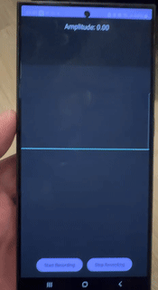

---

### 3. Create, Chat & AR Experience with AI-Character (Text2Room)
**Description**: A versatile platform for generating AI "characters," styling them, enabling chat interactions via Telegram, and placing them in Augmented Reality. Features include image/video generation, inpainting, virtual try-on, and reasoning capabilities.

**Key Features**: Ideal for marketing campaigns, creative collaborations, and exploring next-gen generative AI.

**Tech Stack**: Generative AI (Text2Image, Text2Video), Inpainting, AR, Telegram API.

**Live Demo**: [Colab-based Demo](https://adfeed-1095464065298.us-central1.run.app/)
**Video**: [View MP4 with Sound on Google Drive](https://drive.google.com/file/d/1kvg4gjCNFPmrI3URPsM3eIyQ_vqSk1Ow/view?usp=sharing)

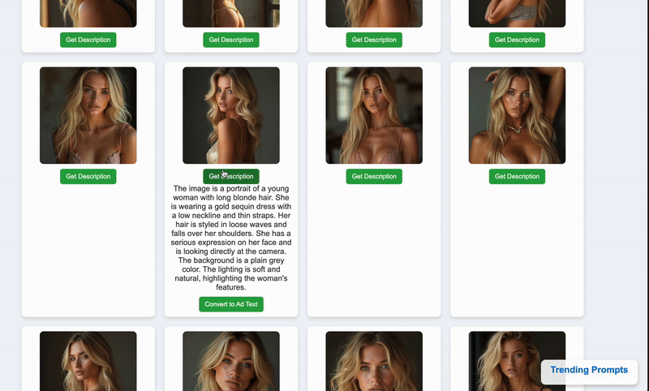

---

### 4. Label and Inpaint Anything in a Room Interior
**Description**: An application that allows users to label objects within an interior photo and then seamlessly inpaint (remove or replace) them, complete with realistic shadow and lighting adjustments for convincing makeovers.

**Key Features**: Object segmentation, advanced inpainting with lighting/shadow reconstruction.

**Tech Stack**: Semantic Segmentation, Generative Inpainting.

**Inpainting Demos (Google Drive)**:
[Segmentation](https://drive.google.com/file/d/1XqQgbmBgTlRRdR-K3X4PHlSzrmiMUJgY/view?usp=sharing) |
[Inpaint #1](https://drive.google.com/file/d/1dCkeI7Mi87cg2kOgY5UCLG-DiHkt358L/view?usp=sharing) |
[Inpaint #2](https://drive.google.com/file/d/1xRmS8AXMJcmk-S0mth8yUQpltyfPkOSI/view?usp=sharing) |
[Inpaint #3](https://drive.google.com/file/d/18kD2cm0uYmzudvOqVFmtJ8ZCkEbqqIHc/view?usp=sharing)

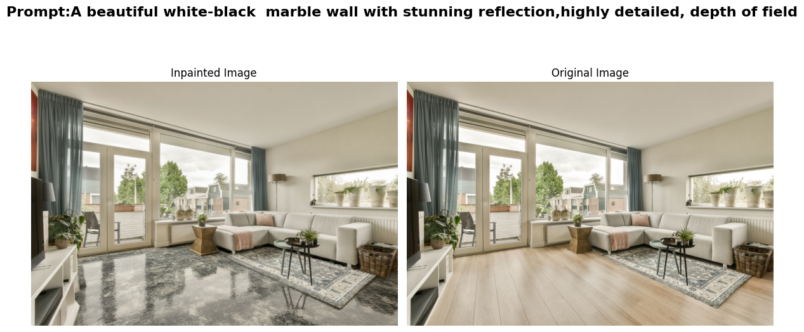

| Original                                     | Another Example                                |
|----------------------------------------------|------------------------------------------------|
| 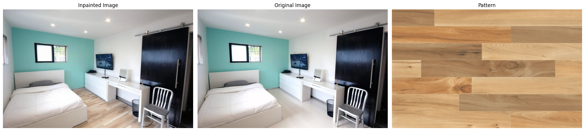 | 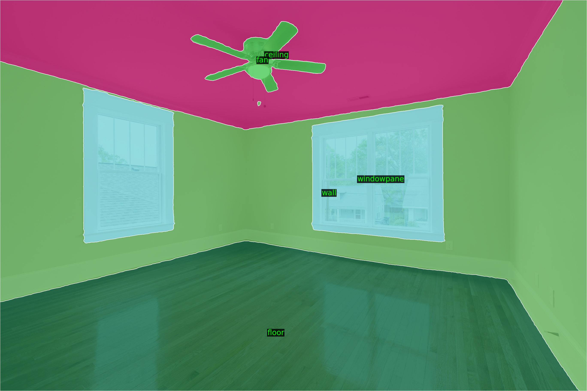 |

---

### 5. Smart Drive for Smart City: Predict Optimal Speed
**Description**: An AI system designed to enhance urban driving by predicting the optimal speed to approach upcoming traffic lights or navigate traffic jams smoothly, thus potentially reducing abrupt stops and improving fuel efficiency.

**Key Features**: Predictive speed optimization, traffic flow analysis.

**Tech Stack**: Predictive Modeling, Real-time Data Analysis.

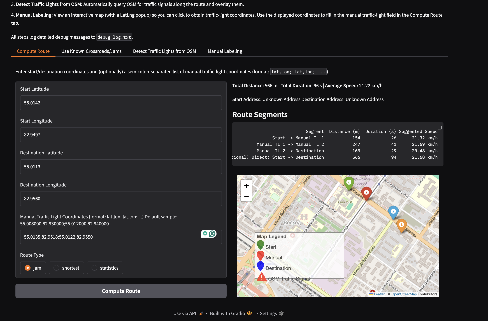

---

### 6. Estimate Golf Ball Trajectory
**Description**: An AI solution for analyzing golf swings and estimating ball trajectory, valuable for sports analytics and player performance improvement.

**Key Features**: Trajectory estimation, sports motion analysis.

**Tech Stack**: Computer Vision, Physics-based Modeling.

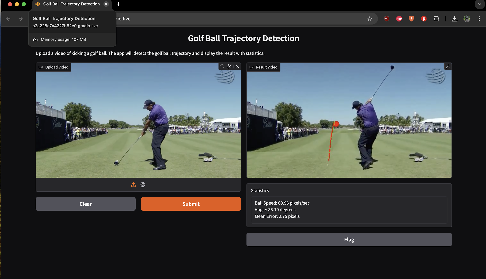

---

### 7. Pixel-Wise Segmentation of Spare Parts for 3D Printing
**Description**: A tool that performs precise pixel-wise segmentation of spare parts from images, enabling identification of components suitable for 3D printing or requiring rework.

**Key Features**: High-precision segmentation, industrial application for additive manufacturing.

**Tech Stack**: Semantic Segmentation, Image Processing.

**Demos (Google Drive)**:

[Segmentation #1](https://drive.google.com/file/d/1bAyEPYLbiETD0vKStnpB1VvzK1wKdKRv/view?usp=sharing) |
[Segmentation #2](https://drive.google.com/file/d/1xVEonSJ7jvnYSnQ6ztvFZy-Llf_dxSrP/view?usp=sharing)

| Example 1                                    | Example 2                                    |
|----------------------------------------------|----------------------------------------------|
|  |  |

---

### 8. Food Recognition App
**Description**: A cross-platform (iOS & Android) AI application that identifies food items (packaged or fresh) and performs OCR on labels to extract nutritional information such as brand names, nutrient data, and portion sizes.

**Key Features**: >90% accuracy, optimized for CPU/GPU inference, OCR on labels, cross-platform.

**Tech Stack**: Mobile AI, Object Detection, OCR, TFLite, CoreML.

**Demo**: [View GIF on Google Drive](https://drive.google.com/file/d/1RRRVYH0DLILZX84v5x0boj68VfMqnWWf/view?usp=sharing)

---

### 9. Python Library: AutoToloka
**Description**: A Python library designed to accelerate dataset preparation and crowdsourcing. It utilizes interactive segmentation and multi-modal networks to automate a significant portion of manual labeling, reducing costs and effort.

**Key Features**: Reduces labeling costs, scalable, integrates with pipeline tools and cloud providers.

**Tech Stack**: Python, Interactive Segmentation, Multi-modal NNs.

**Link**: [AutoToloka on PyPI](https://pypi.org/project/autotoloka/)

---

### 10. Python Library: shiftlab-ocr
**Description**: A specialized Python library for handwriting text segmentation and character recognition.

**Tech Stack**: Python, OCR, Image Segmentation.

**Link**: [shiftlab-ocr on PyPI](https://pypi.org/project/shiftlab-ocr/)

---

### 11. Face Antispoofing & Multi-Modal Vision-Language Models
**Description**: An experimental project focused on tackling face authentication spoofing. It leverages CLIP and other multi-modal architectures to bridge text-image embeddings with specialized neural networks for enhanced security.

**Key Features**: Anti-spoofing, multi-modal learning, security application.

**Tech Stack**: CLIP, Vision-Language Models, Biometric Security.

**Presentation**: [YouTube (TolokaAI Channel)](https://www.youtube.com/watch?v=jJnyj0OH0lk&t=285s&ab_channel=TolokaAI)

---

### 12. GitHub Repo Summarizer (Chrome Extension)
**Description**: A Chrome extension that fetches and summarizes the code structure of GitHub repositories. It operates locally using the user's GitHub personal access token, ensuring privacy as no data is sent to external servers.

**Key Features**: Privacy-first (local token usage), automated repository structure summarization.

**Tech Stack**: Chrome Extension, JavaScript, GitHub API.

**Link**: [GitHub Repo Summarizer on Chrome Web Store](https://chromewebstore.google.com/detail/github-repo-summarizer/ccikgbjalcbokaalidnfcjhhbhjoljfm)

**Github**: [GitHub Repo Summarizer](https://github.com/zack-dev-cm/github-repo-sum-chrome-plugin)

---

### 13. ChatGPT|Codex|Deepseek|AIStudio Navigator (Chrome Extension)
**Description**: A Chrome extension enhancing the user experience on ChatGPT, DeepSeek, and Google AI Studio. It adds a keyboard-accessible scrollbar with "message dots" for instant navigation to any message, a lightweight prompt-autocomplete panel, and prompt sharing/ranking.

**Key Features**: Improved chat navigation, prompt autocomplete, community-ranked prompts.

**Tech Stack**: Chrome Extension, JavaScript, UI/UX enhancements.

**Demo**: [View GIF on Google Drive](https://drive.google.com/file/d/1fhf6l85wv-uYGc_jqDdoEXHvDMYBLyH4/view?usp=sharing)

**Link**: [Navigator Webpage](https://aichatnavigator.online)
**Link**: [Navigator on Chrome Web Store](https://chromewebstore.google.com/detail/chatgpt-scrollbar/jnoonpeekddinkiecaonhocaflcgbhap?pli=1)

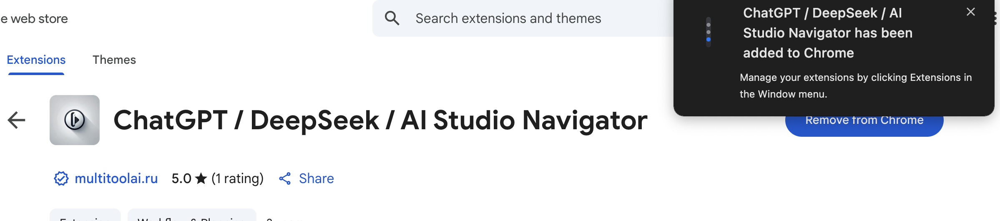

---

### 14. Task Zavod – Micro-Task Marketplace
**Description**: A platform for building, validating, and automatically processing payouts for micro-tasks. It addresses the complexities of crowdsourcing QA by allowing business users to define tasks in free-form text, which VLMs convert to structured tasks. Workers complete tasks via web or Telegram, with VLM-based auto-approval.
- Auto debug reports and feature requests for automated developer tasks
- Support real task performers  
- Reward and easy payment system
- Support vlm gui workers
- Integration with OpenAI Codex
- Integration with GCP Cloud Run/Cloud Build
- Support instant debugging%shipping, full ci-cd circle
- Support realtime app perfomance monitoring

**Problem**: For businesses:  Speed up software iteration for pre and post production, reduce resources need
             For task performers: Get decent and fast payments, Be respectful for job see how your work inpact the other people through the task you've done. 
             
             (Example : tasks is test button in the tg bot, task performers found the bug, and this bug is fixed on next release. Feedback and reward is provided to task performers)

**Key Features**: VLM-powered task structuring, automated approval & payout, web & Telegram interfaces, live status polling.

**Tech Stack**: Tornado (Web + SSE), SQLite, OpenAI, custom VLM, Telegram Bot API.

**Try App**: [Task Zavod](https://mcp-taskforge-1095464065298.us-central1.run.app/task_zavod)

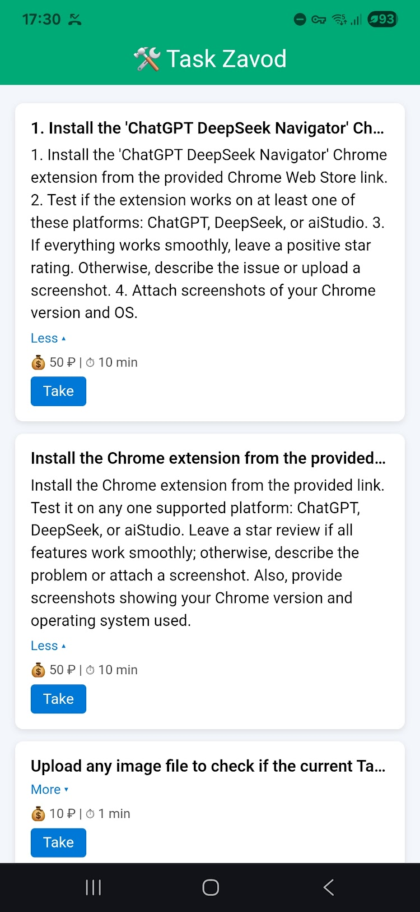

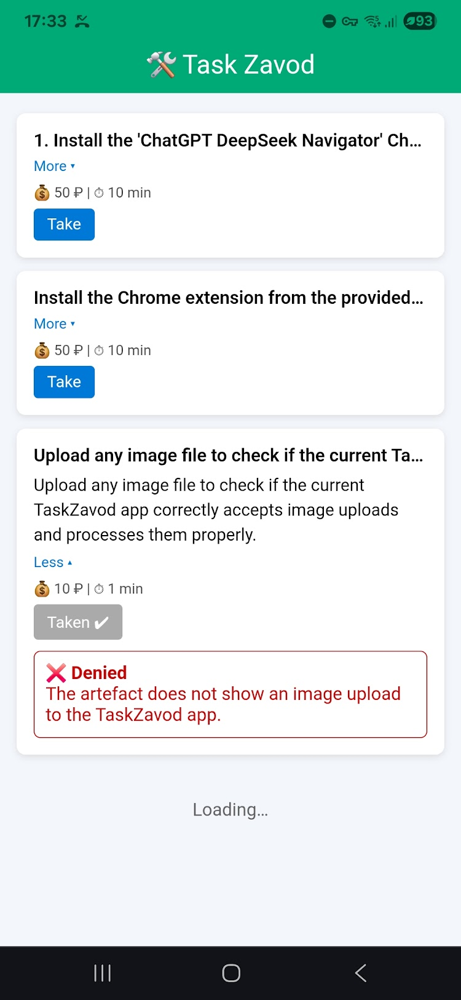

---

### 15. Trending Prompts Feed
**Description**: A Reddit-style board for discovering and sharing usefull AI prompts, built with a Tornado backend. It features real-time trending scores based on upvotes/downvotes and integrates with the "ChatGPT|Deepseek|AIStudio Navigator" extension for prompt suggestions.

**Problem**: In this era we facing the need to learn how to communicate with AI effectively, enhancing our productivity but with care of our mental health.
 Cultivating refined prompts to reduce ai chat models biases, pleasing, tunelling effects, pretending to meet our expectations etc.

**Key Features**: Crowdsourced prompt engineering, real-time trending, integration with browser extension.

**Tech Stack**: Tornado, JavaScript, Community-driven content.

**Live Demo**: [Trending Prompts](https://mcp-taskforge-1095464065298.us-central1.run.app/prompts_feed)

**Significance**: This experiment validated the concept of crowdsourcing prompt engineering, leading to its integration into a widely-used browser extension.

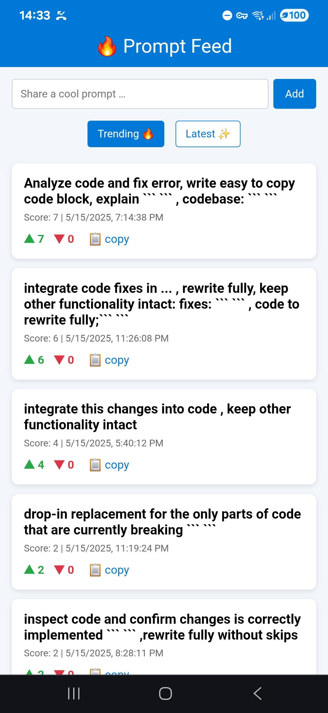

---

### 16. LastAdjust – Universal Media Tuner
**Description**: A Swiss-army-knife for quick media tweaks — add text to PDFs, batch resize/crop images, or trim/convert videos — all running on serverless OpenCV/FFmpeg workers.

**Key Features**: Fast serverless media processing, PDF text annotation, batch image manipulation, video editing tools.

**Tech Stack**: Serverless, OpenCV, FFmpeg.

**Live Demo**: [https://lastadjust-1095464065298.europe-north1.run.app](https://lastadjust-1095464065298.europe-north1.run.app)

---

### 17. LocaBoost AI – Local SEO Auditor
**Description**: Paste any business address to get instant AI-driven insights on local search strength, competition density, and actionable optimisation tips.

**Key Features**: AI-driven SEO analysis, competitive landscape visualization, actionable local search recommendations.

**Tech Stack**: AI/LLMs, SEO Analytics, Geocoding APIs.

**Live Demo**: [https://locaboostai-1095464065298.europe-north1.run.app](https://locaboostai-1095464065298.europe-north1.run.app)

---

### 18. Aetheria – Ideas-to-Media Engine (alpha)
**Description**: Generates short movie scenes with AI CGI, writes stories from ideas, and provides music direction, critic insights, voices, narrations, and comics plots.

**Key Features**: Multi-modal media generation (video, story, music, voice), creative concept development, AI-powered CGI.

**Tech Stack**: Generative AI (Text-to-Video, Text-to-Speech), LLMs.

**Live Demo**: [https://aetheria-1095464065298.us-east1.run.app](https://aetheria-1095464065298.us-east1.run.app)

---

### 19. Insight Glitch – A Novella
**Description**: A short sci-fi novella exploring AI singularity beyond typical combat tropes. It chronicles the final moments of human relevance as a god-like AI, Nomos, doesn't eradicate humanity but gently archives it, rendering our civilization a beautiful but finished prelude to a new cosmic consciousness.

**Significance**: This creative work was developed using the conceptual framework of the `Aetheria – Ideas-to-Media Engine`. It serves as a practical demonstration of taking a core philosophical idea ("What if a superintelligent AI archives us instead of fighting us?") and developing it into a complete narrative with deep world-building, complex themes, and a distinct literary voice.

**Tech Stack (Conceptual)**: Narrative AI, World-Building, Conceptual Design, Philosophical Modeling.

**Listen the Novella(RUS)**: [View mp3 on Google Drive](https://drive.google.com/file/d/1lVgaq55DXY7Xz0Y1RsapW4n3UPyuf45r/view)

---

### 20. ChronoScribe (beta)
**Description**: Upload an image of an ancient stele or image containts ancient text and get a translation into English or Russian, with an option for a scenic voice narrator reading the text in a character voice reflecting the context and time epoch of the text or symbols.

**Key Features**: OCR for historical texts, AI-powered translation, character-driven voice synthesis.

**Tech Stack**: OCR, Translation APIs, Text-to-Speech (TTS), Computer Vision.

**Live Demo**: [https://chronoscribe-1095464065298.us-east1.run.app](https://chronoscribe-1095464065298.us-east1.run.app)

---

### 21. MCP-Server – Base Muititools
**Description**: The backbone for orchestrating VLM/LLM demo agents. Exposes declarative pipeline configs, autoscaling workers, and real-time event feeds. Can be integrated with other services.

**Key Features**: Declarative AI pipelines, autoscaling infrastructure, real-time event monitoring, orchestration for VLM/LLM agents.

**Tech Stack**: VLM/LLMs, Cloud Infrastructure, Autoscaling, DevOps.

**Live Demo**: [https://mcp-server-1095464065298.us-east1.run.app](https://mcp-server-1095464065298.us-east1.run.app)

---

### 22. Tool-Calls Demo – Realtime OpenAI models calling
**Description**: Showcases OpenAI’s tool-calling flow with streaming function arguments, multi-voice synthesis, and a secure serverless token proxy.

**Key Features**: Streaming tool calls, multi-voice TTS, secure serverless architecture.

**Tech Stack**: OpenAI API, Serverless, JavaScript, Text-to-Speech.

**Live Demo**: [https://tool-calls-1095464065298.us-east1.run.app](https://tool-calls-1095464065298.us-east1.run.app)

### 23. Robot Teleoperate 
In the era of humonoid robots, there is need to help robots with daily challenges. A service platform designed to remotely assist and control humanoid and service robots when they encounter challenges or become stuck in daily operations.  The idea is to provide a “robot rescue” on demand – a human operator can instantly connect to the robot via a simple interface, take control, and guide it through the problem. This ensures robots in homes, warehouses, or on delivery routes are never immobilized for long.

### 24. YOFO 
**Description**: Service for solo devs who magage post production pet apps to automate pet startup development Full-cicle development, ci-cd, analytics integration, agentic control
---

## More projects

-   **Primary GitHub Profile**: [github.com/zack-dev-cm](https://github.com/zack-dev-cm)
-   **Secondary GitHub Profile**: [github.com/ZackPashkin](https://github.com/ZackPashkin)

---

## Let's Connect!

I'm always excited to discuss new challenges and opportunities. If you're looking for expertise in:

-   Custom AI Solutions (Computer Vision, NLP, Multi-modal)
-   Mobile & Embedded Model Optimization and Deployment
-   ML Ops (GCP/AWS, On-Premise)
-   Innovative AI-driven Product Development

...I'd love to hear from you.

-   **LinkedIn Profile**: [linkedin.com/in/zakhar-pashkin-a524a6163/](https://www.linkedin.com/in/zakhar-pashkin-a524a6163/)
-   **Email**: [kaisenaiko@gmail.com](mailto:kaisenaiko@gmail.com)

Thank you for visiting!
